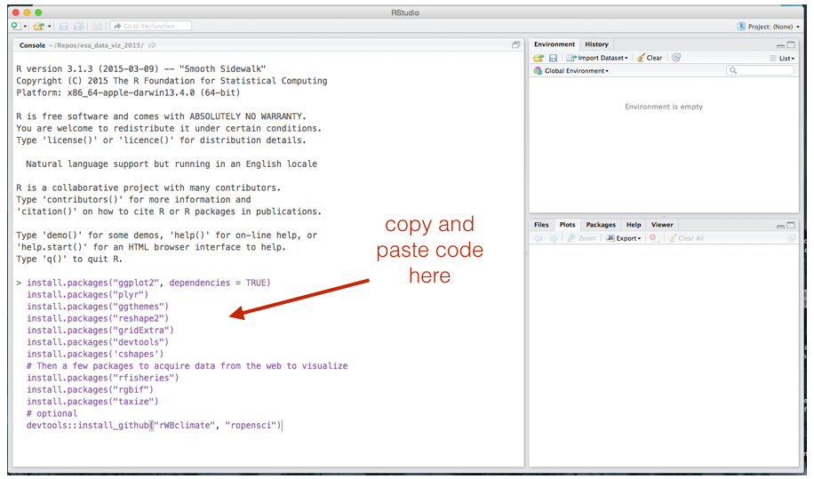

# ESA 2015 workshop on Data Visualization using R.

Welcome to the GitHub repository for the data visualization using R and ggplot workshop at ESA 2015.

### NOTE: This will be a work in progress until early August 2015.

**Location and time:** 
Sunday, August 9, 2015    
12:00 PM - 5:00 PM   
309, Baltimore Convention Center

## Organizers
[Naupaka Zimmerman](http://naupaka.net) and [Andrew Tredennick](http://atredennick.github.io/).

---

## Pre workshop instructions

**Important:** There will be wifi in conference rooms this year, but plan on spending 10 minutes Saturday night (or even before arriving in Baltimore) to download and install R and RStudio, to install the packages listed below, and to download a local copy of this repository (see instructions below). It takes a bit of bandwidth to do all this, so best not to rely on convention center wifi.

### Installing R  
If you don't already have R set up with a suitable code editor, we recommend downloading and installing [R](http://cran.cnr.berkeley.edu) and [RStudio Desktop](http://www.rstudio.com/ide/download/) for your platform. Once installed, open RStudio and install the following packages. Simply paste these commands into your prompt. 

### Installing packages

```coffee
install.packages("ggplot2", dependencies = TRUE)
install.packages("plyr")
install.packages("ggthemes")
install.packages("reshape2")
install.packages("gridExtra")
install.packages("devtools")
install.packages('cshapes')
# Then a few packages to acquire data from the web to visualize
install.packages("rfisheries")
install.packages("rgbif")
install.packages("taxize")
# optional
devtools::install_github("rWBclimate", "ropensci")
```

You will want to copy and paste the above into the "Console" of RStudio, like below. After copying and pasting, simply hit <Enter>, and you will see a bunch of text letting you know that they are being installed.



### Downloading code/data from this repository  
If you're already familiar with `Git`, then simply clone this repo. If you're not familiar with Git, simply hit the **Download ZIP** button on the right side of this page. If you're not sure where to save it, just download and unzip to your Desktop.

*Please wait until Saturday afternoon to this so you are able to download the latest changes. Otherwise do another git pull or replace your donwloaded copy with a newer one.*


If you're having any trouble with these steps please drop us an [email](mailto:naupaka@gmail.com). We'll also strive to have local copies if you forget to install any of these tools.

See you Sunday!


---

# License  
<a rel="license" href="http://creativecommons.org/licenses/by/2.0/">Creative Commons Attribution 2.0 Generic License</a>.

